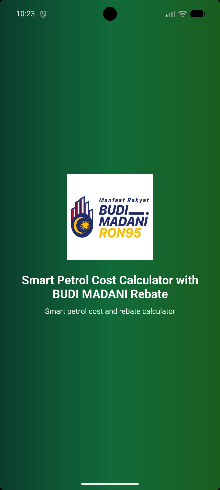
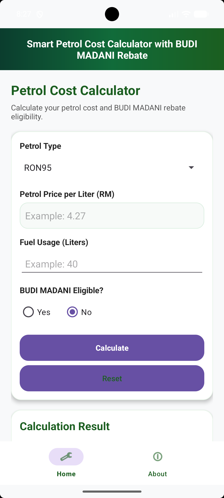
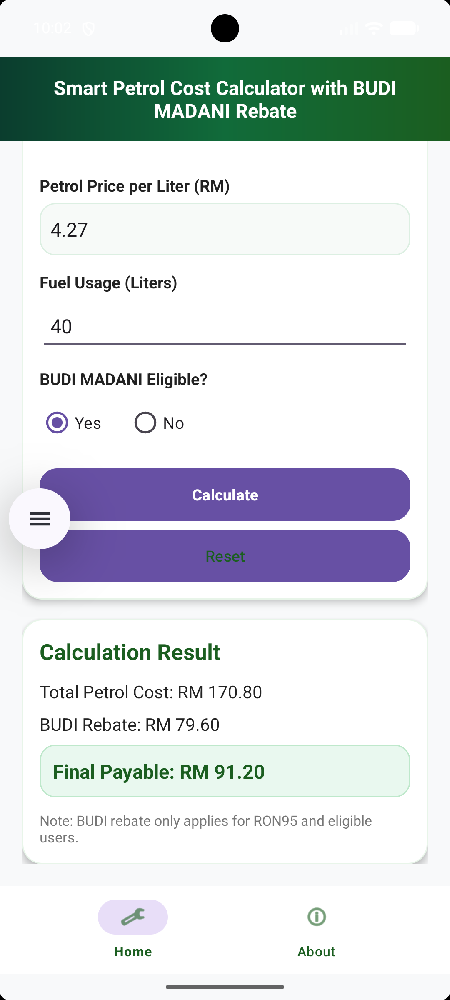
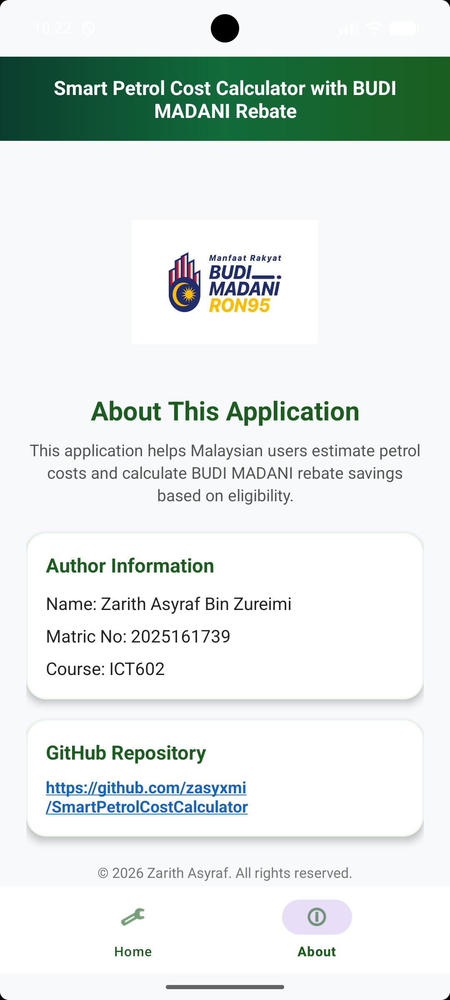

# Smart Petrol Cost Calculator with BUDI MADANI Rebate (Malaysia)

## 📱 Project Overview

Smart Petrol Cost Calculator with BUDI MADANI Rebate is an Android mobile application developed using **Java** and **XML** in Android Studio. The application helps users estimate their petrol expenses in Malaysia and calculate the applicable BUDI MADANI fuel rebate based on petrol type and eligibility status.

This project was developed for the **ICT602 Mobile Technology** individual assignment.

---

## 👨‍💻 Author Information

| Item | Details |
|------|---------|
| Name | Zarith Asyraf Bin Zureimi |
| Matric No | 2025161739 |
| Course | ICT602 |
| Year | 2026 |


---

## 🎯 Application Objectives

The main objectives of this application are:

- To calculate the total petrol cost based on fuel usage and petrol price per liter.
- To apply the BUDI MADANI rebate only for eligible users using RON95 petrol.
- To display the calculation result clearly in Malaysian Ringgit (RM).
- To provide a simple and user-friendly Android interface with Home and About pages.

---

## ⚙️ Main Features

### 1. Petrol Cost Calculator

Users can enter:

- Petrol type: RON95, RON97, or Diesel
- Petrol price per liter
- Fuel usage in liters
- BUDI MADANI eligibility status: Yes or No

### 2. BUDI MADANI Rebate Logic

The rebate is calculated using the subsidy rate of:

```text
RM 1.99 per liter
```

## 📸 Application Screenshots

| Splash Screen | Home Page |
|--------------|-----------|
|  |  |

| Calculation Result | About Page |
|--------------------|------------|
|  |  |

``` 

